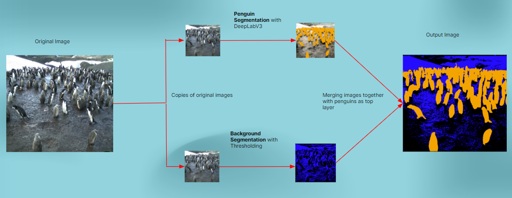
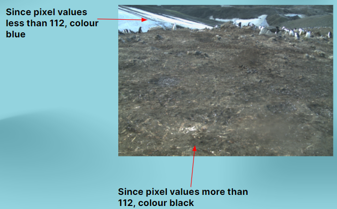
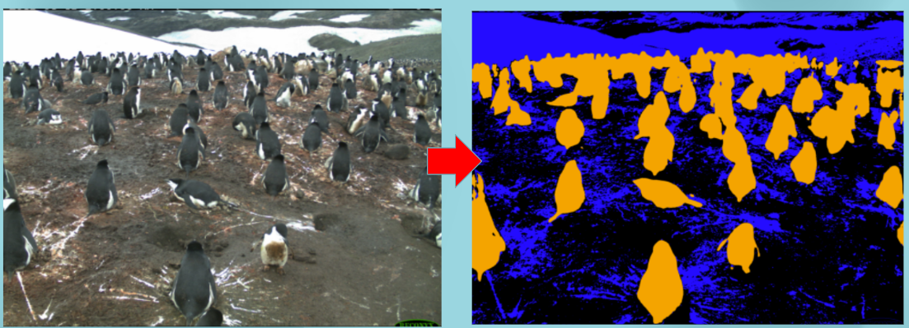

# Penguin Segmentation Research Documentation

The final project resulting from ECE 471, Computer Vision with David Capson, conducted in the Spring of 2024. The aim is to to apply computer vision techniques in penguin segmentation, facing the many challenges computer vision researchers face in pursuit of a solution. For reference, segmentation is the process of classifying every pixel of an image and where it belongs to.

## Authors
- **Doug Cruz**
  - Software Engineering Undergraduate at the University of Victoria
- **Brent Machado**
  - Software Engineering Undergraduate at the University of Victoria

## Introduction
This research focuses on the challenge of segmenting distinct regions within Antarctic images, including categories such as penguins, sky, rock, snow, water, and icebergs. Utilizing deep learning methodologies has proven effective, particularly for penguin detection, surpassing traditional computer vision techniques which require intricate feature selection expertise.

## Dataset
The dataset consists of images from the [Penguin Watch Project](https://www.robots.ox.ac.uk/~vgg/data/penguins/), covering various Antarctic locations, primarily featuring penguins against backgrounds of snow and rocks. The extensive dataset includes over 28GB of RGB images.

## Methodology
Our approach employs a two-pronged segmentation strategy:
1. **Penguin Segmentation**: Utilizes a pretrained DeepLabv3 model with a ResNet-101 backbone, optimized for bird recognition, to effectively identify and segment penguins.
2. **Background Segmentation**: Implements binary thresholding techniques for distinguishing rock and snow, using color intensity thresholds to segment these elements accurately.

## Experiments and Analysis
- **Deep Learning Model**: DeepLabv3 with ResNet-101 was applied for its robust feature extraction capabilities and efficient handling of multi-scale contextual information.
- **Threshold Techniques**: Experimentation with various threshold levels led to effective segmentation of non-animal elements, with specific thresholds providing optimal separation of snow and rock.

## Results
The segmentation pipeline demonstrated strong performance in accurately segmenting penguins, rocks, and snow. Manual inspections and direct comparisons with the original images supported the qualitative assessment of the segmentation outcomes.

## Challenges
- **Data Quality and Sparsity**: Issues with image clarity and repetitive scenery were addressed by selectively processing higher-quality images and ensuring a diverse dataset representation.
- **Computational Limitations**: The heavy computational demands of the models required optimizations and a predominantly qualitative evaluation approach due to limited access to advanced computational resources.

## Conclusion
The dual-processing methodology for segmentation effectively handles the complex variability in Antarctic imagery. While DeepLabv3 provides a reliable framework for penguin segmentation, the simple yet effective thresholding techniques for background segmentation prevent overfitting and accommodate local variations in image brightness.

## Future Work
Further research will focus on developing adaptable thresholding methods and enhancing the model training with a more extensive and varied dataset, potentially improving performance on lower-quality images.
